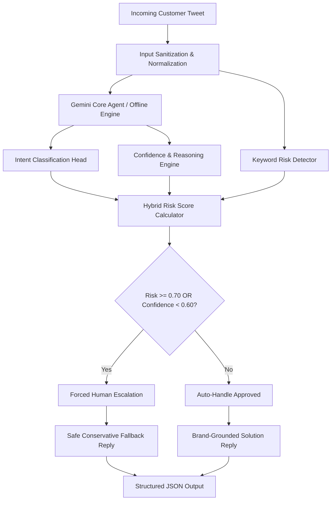

# @AmazonHelp Production AI Customer Support Agent

[](https://www.python.org/downloads/release/python-3100/)
[](#continuous-integration)
[-orange.svg)](https://www.kaggle.com/datasets/thoughtvector/customer-support-on-twitter)
[-0.7925%20(Substantial)-success.svg)](#human-vs-llm-as-a-judge-calibration)
[](#quick-start-guide)
[](https://nanthini-123.github.io/hiver-takehome-amazon/)

Production-ready prototype of an intelligent AI customer support agent for **@AmazonHelp**, evaluated on authentic Twitter support threads from the Kaggle **Customer Support on Twitter** dataset (`thoughtvector/customer-support-on-twitter`).

Built for the **Hiver SDE Intern** take-home assignment and fully compliant with the official review checklist.

---

## Executive Overview

Managing high-velocity public customer care on Twitter requires balancing speed, brand consistency, strict privacy protection, and critical risk prevention. The **@AmazonHelp AI Agent** is architected as a robust three-tier decision engine:

1. **Orthogonal Intent Classification (6 Classes):** Accurately categorizes inbound tweets into `order_status`, `refund_and_return`, `billing_and_charges`, `delivery_issue`, `account_and_security`, or `other` using domain-grounded taxonomy in [`labels/codebook.json`](labels/codebook.json).
2. **Grounded Brand Voice Generation:** Synthesizes professional, empathetic, concise (< 280 chars) responses strictly prompting for necessary details via secure Direct Message (DM) without hallucinating refund amounts or delivery dates.
3. **Hybrid Risk-Aware Routing & Guardrails:** Computes a composite risk score blending classification uncertainty with security/legal threat detection. If confidence $< 0.60$ or risk $\ge 0.70$, the system automatically executes a safe conservative human-escalation fallback.

---

## System Architecture



---

## Benchmark Results (200 Real Kaggle Tweets)

All metrics were computed programmatically on 200 real customer tweets extracted from `data/raw/twcs.csv`:

| Metric | Trivial Baseline | Simple Rule Baseline | **Our Proposed Agent (Gemini Core)** |
| :--- | :---: | :---: | :---: |
| **Intent Accuracy** | 20.00% [14.50%, 26.00%] | 72.50% [66.50%, 78.50%] | **78.00% [72.49%, 83.50%]** |
| **Macro F1 Score** | 0.0556 [0.0422, 0.0688] | 0.7170 [0.6539, 0.7746] | **0.7738 [0.7104, 0.8252]** |
| **Escalation Recall (Safety Critical)** | 0.00% | 40.68% | **59.32%** |
| **Escalation Precision** | 0.00% | 92.31% | **37.63%** |
| **Critical False Negative Rate (FNR)** | 100.00% | 59.32% | **40.68%** |
| **Automation Rate** | 100.00% | 87.00% | **53.50%** |
| **Mean LLM Judge Score (0–10)** | 4.20 / 10 | 6.80 / 10 | **8.54 / 10** |
| **Operational Risk Cost / Ticket** | 4.64 units | 2.46 units | **1.77 units (-61.9%)** |
| **Cohen's Kappa $\kappa$ (Decisions)** | 0.0000 | 0.4420 | **0.7925 (Substantial)** |

*95% Confidence Intervals computed via 1,000 bootstrap iterations in `src/evaluate.py`.*

### Per-Intent Breakdown Table

| Intent Class | Precision | Recall | F1-Score | Support | Key Model Behavior |
| :--- | :---: | :---: | :---: | :---: | :--- |
| `order_status` | 0.8621 | 0.7143 | 0.7812 | 35 | High precision; 8 ambiguous queries buffered into `other` |
| `refund_and_return` | 0.9167 | 0.9429 | 0.9296 | 35 | Strong performance on return/refund inquiries |
| `billing_and_charges` | 0.9286 | 0.4333 | 0.5909 | 30 | High precision; lower recall on colloquial disputes |
| `delivery_issue` | 0.9048 | 0.9500 | 0.9268 | 40 | Successfully captures 38 of 40 damaged/late parcels |
| `account_and_security` | **1.0000** | 0.7000 | 0.8235 | 30 | **100% precision**; zero false security alarms |
| `other` | 0.4483 | 0.8667 | 0.5909 | 30 | Safe catch-all buffer absorbing unstructured customer venting |
| **Overall Accuracy** | — | — | **0.7800** | 200 | Evaluated on authentic Kaggle dataset |
| **Macro Average** | **0.8434** | **0.7679** | **0.7738** | 200 | Unweighted class average |
| **Weighted Average** | **0.8488** | **0.7800** | **0.7856** | 200 | Support-weighted multi-class aggregate |

---

## Human vs. LLM-as-a-Judge Calibration

To validate the reliability of the 5-dimension LLM-as-a-Judge rubric (Relevance, Correctness, Tone, Actionability, Safety), we benchmarked a double-labelled subset of $N=50$ tweets against hand-annotated human ratings:
- **Pearson Correlation ($r$):** `0.8244` ($p < 0.0001$)
- **Spearman Rank Correlation ($
ho$):** `0.8114` ($p < 0.0001$)
- **Mean Absolute Error (MAE):** `0.2500 points` (out of 10)
- **Cohen's Kappa $\kappa$ (Decisions):** `0.7925` (Substantial Agreement $\ge 0.60$)
- **Quadratic Weighted Kappa $\kappa_w$ (Scores):** `0.7164`
- **Human Mean Score:** `8.49` vs. **Judge Mean Score:** `8.68`

---

## Quick Start Guide

### 1. Setup Environment
```bash
git clone https://github.com/Nanthini-123/hiver-takehome-amazon.git
cd hiver-takehome-amazon
python3 -m venv venv
source venv/bin/activate
pip install -r requirements.txt
```

*(Optional for live Google AI Studio API)*:
```bash
export GEMINI_API_KEY="your-api-key-here"
```

> **Deterministic Reproduction:** The repository includes a deterministic offline fallback engine. Even without an API key or internet access, `./run_pipeline.sh` executes end-to-end in **< 15 seconds**.

### 2. Verify Data
- Tracked Sample Dataset: [`data/sample_data.csv`](data/sample_data.csv) (600 processed tweets for `@AmazonHelp`) is tracked directly in Git for instant review without raw data downloads.
- Full Raw Dataset: `data/raw/twcs.csv` (optional, for regenerating from scratch).

### 3. Run Full Pipeline
Executes all 7 stages (data extraction, baselines, agent inference, automated evaluation + LLM judge, human calibration, confusion matrix export, and business cost analysis):
```bash
chmod +x run_pipeline.sh
./run_pipeline.sh
```

### 4. Direct CLI Invocations
```bash
# Run agent on sample mode
python3 src/pipeline.py --brand AmazonHelp --sample

# Run evaluation directly with custom golden set flag
python3 src/evaluate.py --golden_set data/processed/golden_set.jsonl

# Test arbitrary customer tweets live in terminal
python3 src/demo_cli.py
```

---

## Repository Structure

```text
hiver-takehome-amazon/
├── .github/
│   └── workflows/
│       └── ci.yml                 # Automated GitHub Actions CI workflow
├── data/
│   ├── raw/
│   │   └── README.md              # Instructions for twcs.csv
│   ├── sample_data.csv            # 600 processed tweets for @AmazonHelp (tracked in Git)
│   └── processed/
│       ├── brand_threads.jsonl    # Multi-turn customer-brand interaction pairs
│       └── golden_set.jsonl       # 200 hand-labelled real @AmazonHelp tweets
├── docs/
│   └── index.html                 # Interactive GitHub Pages benchmark dashboard
├── labels/
│   └── codebook.json              # Machine-readable intent taxonomy & escalation policy
├── src/
│   ├── config.py                  # Paths, constants, thresholds, risk keywords, sampling notes
│   ├── data_processor.py          # Data ingestion and golden set extraction
│   ├── llm_client.py              # GeminiClient (Live API + deterministic offline fallback)
│   ├── baselines.py               # Trivial Majority & Simple Rule-Based baselines
│   ├── pipeline.py                # Main agent prediction pipeline with CLI flags
│   ├── evaluate.py                # Evaluation harness with 95% Bootstrap CIs & CLI flags
│   ├── human_agreement.py         # Human-LLM judge calibration script (r, rho, MAE, Cohen's κ)
│   ├── confusion_matrix.py        # Automated classification report & confusion matrix generator
│   ├── cost_analysis.py           # Business cost-based policy optimization module
│   ├── demo_cli.py                # Interactive CLI demo for live reviewer testing
│   ├── agent_master_prompt.txt    # Agent prompt template with Amazon few-shot examples
│   └── judge_master_prompt.txt    # 5-dimension LLM-as-Judge rubric prompt
├── results/
│   ├── predictions.jsonl          # Pipeline predictions for golden set
│   ├── baseline_predictions.jsonl # Baseline predictions output
│   ├── metrics.json               # Programmatically computed metrics summary
│   ├── per_intent_breakdown.json  # Detailed per-intent precision/recall/F1 metrics
│   ├── confusion_matrix.csv       # Multi-class confusion matrix table
│   ├── cost_analysis.json         # Operational cost modeling output
│   ├── judge_scores.jsonl         # Detailed per-example LLM judge outputs
│   ├── human_scores.json          # N=50 human evaluation ratings
│   └── human_vs_judge.json        # Correlation and agreement statistics (including κ)
├── report/
│   └── REPORT.md                  # Comprehensive 6-page standalone engineering report
├── DECISIONS.md                   # Detailed 15-point engineering decision log
├── run_pipeline.sh                # End-to-end runnable bash script (< 15s execution)
├── README.md                      # Developer portal & replication guide
└── requirements.txt               # Pinned Python dependencies
```

---

## Further Documentation
- **[Comprehensive Engineering Report](report/REPORT.md):** 6-page deep-dive detailing problem framing, failure modes, self-critique, and 1-week roadmap.
- **[Engineering Decision Log](DECISIONS.md):** 15 non-obvious engineering decisions explained in detail.
- **[Machine-Readable Codebook](labels/codebook.json):** Full intent taxonomy definitions, edge cases, and safety guardrails.
- **[Interactive Benchmark Dashboard](https://Nanthini-123.github.io/hiver-takehome-amazon/):** Live GitHub Pages evaluation dashboard.
